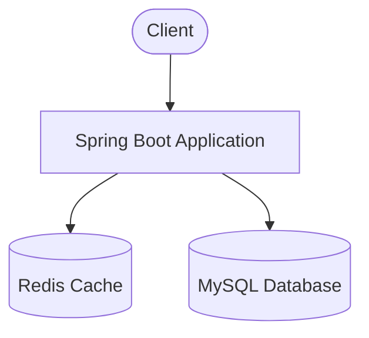
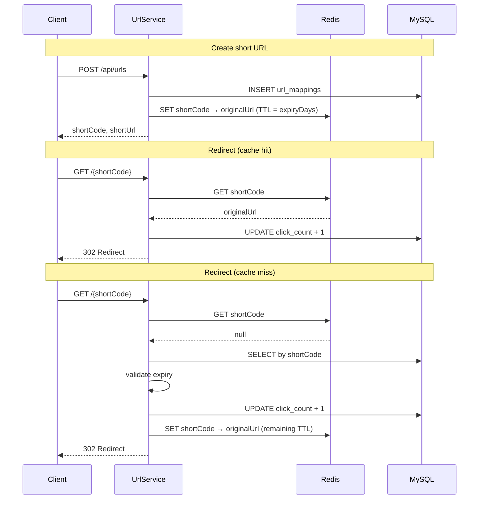

# URL Shortener

A production-oriented URL shortening service built with **Spring Boot 3**, **MySQL**, and **Redis**. It generates compact short links, redirects users with low latency via caching, and exposes analytics for click tracking.

---

## Project Overview

This service allows clients to:

- **Shorten** long URLs into 6-character Base62 codes
- **Redirect** users to the original URL with HTTP 302
- **Track** click counts and view analytics per short code

**Tech stack**

| Layer | Technology |
|---|---|
| Runtime | Java 21 |
| Framework | Spring Boot 3.4.1 |
| Persistence | Spring Data JPA, MySQL 8 |
| Cache | Spring Data Redis, Redis 7 |
| API docs | springdoc-openapi (Swagger UI) |
| Build | Maven |

---

## Architecture




**Request flow summary**

1. **Create** — validate input → generate unique short code → persist to MySQL → cache in Redis with TTL
2. **Redirect** — check Redis first → fallback to MySQL → validate expiry → increment click count → redirect
3. **Analytics** — read metadata and click count directly from MySQL

---

## Database Schema

Table: `url_mappings`

| Column | Type | Constraints | Description |
|---|---|---|---|
| `id` | `BIGINT` | PK, auto-increment | Surrogate key |
| `original_url` | `VARCHAR` | NOT NULL | Full destination URL |
| `short_code` | `VARCHAR` | NOT NULL, UNIQUE | 6-character Base62 code |
| `click_count` | `BIGINT` | NOT NULL | Total successful redirects |
| `created_at` | `DATETIME` | NOT NULL | Creation timestamp |
| `expiry_date` | `DATETIME` | nullable | Expiration timestamp |

```sql
CREATE TABLE url_mappings (
    id           BIGINT       NOT NULL AUTO_INCREMENT PRIMARY KEY,
    original_url VARCHAR(255) NOT NULL,
    short_code   VARCHAR(255) NOT NULL UNIQUE,
    click_count  BIGINT       NOT NULL,
    created_at   DATETIME(6)  NOT NULL,
    expiry_date  DATETIME(6)
);
```

Schema is managed automatically via Hibernate (`spring.jpa.hibernate.ddl-auto=update`).

---

## Redis Caching Flow

Redis stores a simple key-value mapping:

```
Key:   {shortCode}        e.g. "aB3xK9"
Value: {originalUrl}      e.g. "https://google.com"
TTL:   expiryDays         aligned with expiry_date
```



Click counts are always persisted in MySQL using an atomic `UPDATE ... SET click_count = click_count + 1` for concurrency safety.

---

## API Endpoints

Base URL: `http://localhost:8080`

| Method | Endpoint | Description |
|---|---|---|
| `POST` | `/api/urls` | Create a short URL |
| `GET` | `/{shortCode}` | Redirect to original URL (302) |
| `GET` | `/api/analytics/{shortCode}` | Get click analytics |

Interactive docs: [http://localhost:8080/swagger-ui.html](http://localhost:8080/swagger-ui.html)

### Create short URL

```http
POST /api/urls
Content-Type: application/json

{
  "originalUrl": "https://google.com",
  "expiryDays": 30
}
```

**Response `200 OK`**

```json
{
  "shortCode": "aB3xK9",
  "shortUrl": "http://localhost:8080/aB3xK9"
}
```

### Redirect

```http
GET /aB3xK9
```

**Response `302 Found`** — `Location` header set to the original URL.

### Analytics

```http
GET /api/analytics/aB3xK9
```

**Response `200 OK`**

```json
{
  "shortCode": "aB3xK9",
  "originalUrl": "https://google.com",
  "clickCount": 12,
  "createdAt": "2026-06-19T10:30:00",
  "expiryDate": "2026-07-19T10:30:00"
}
```

### Error responses

All errors return a consistent JSON body:

```json
{
  "timestamp": "2026-06-19T10:30:00",
  "status": 404,
  "message": "Short URL not found: xyz999"
}
```

| Status | Meaning |
|---|---|
| `404` | Short code does not exist |
| `410` | Short URL has expired |

---

## Local Setup

### Prerequisites

- Java 21
- Maven 3.9+
- Docker (for MySQL and Redis)

### 1. Start infrastructure

```bash
docker compose up -d
```

This starts:

- **MySQL** on `localhost:3306` (database: `url_shortener`, user: `root`, password: `root`)
- **Redis** on `localhost:6379`

### 2. Run the application

```bash
mvn spring-boot:run
```

The API is available at `http://localhost:8080`.

### 3. Verify

```bash
# Create a short URL
curl -X POST http://localhost:8080/api/urls \
  -H "Content-Type: application/json" \
  -d '{"originalUrl":"https://google.com","expiryDays":30}'

# Redirect (follow with -L to see final destination)
curl -I http://localhost:8080/{shortCode}

# Analytics
curl http://localhost:8080/api/analytics/{shortCode}
```

---

## Docker Setup

`docker-compose.yml` provisions MySQL and Redis with Apple Silicon (`linux/arm64`) support:

```bash
# Start services
docker compose up -d

# Check health
docker compose ps

# Stop services
docker compose down

# Stop and remove volumes
docker compose down -v
```

| Service | Image | Port | Credentials |
|---|---|---|---|
| MySQL | `mysql:8` | `3306` | `root` / `root` |
| Redis | `redis:7` | `6379` | — |

The Spring Boot application runs on the host and connects to these containers via `localhost`.

---

## Project Structure

```
src/main/java/com/nanditha/urlshortener/
├── config/          # Redis and OpenAPI configuration
├── controller/      # REST and redirect endpoints
├── dto/             # Request/response models
├── entity/          # JPA entities
├── exception/       # Custom exceptions and global handler
├── repository/      # Spring Data JPA repositories
├── service/         # Business logic
└── util/            # ShortCodeGenerator
```

---

## Future Improvements

- **Custom domains** — support branded short-link domains per tenant
- **Rate limiting** — protect create and redirect endpoints from abuse
- **Async click tracking** — decouple click increments from redirect latency at very high scale
- **Bulk URL creation** — batch API for importing many URLs
- **Admin dashboard** — UI for managing and monitoring links
- **Kubernetes deployment** — Helm charts with horizontal pod autoscaling
- **Integration tests** — Testcontainers coverage for MySQL and Redis flows
- **URL validation** — blocklist malicious domains and enforce HTTPS
- **Metrics & observability** — Prometheus metrics, distributed tracing, and structured logging

---

## License

This project is provided for educational and demonstration purposes.
